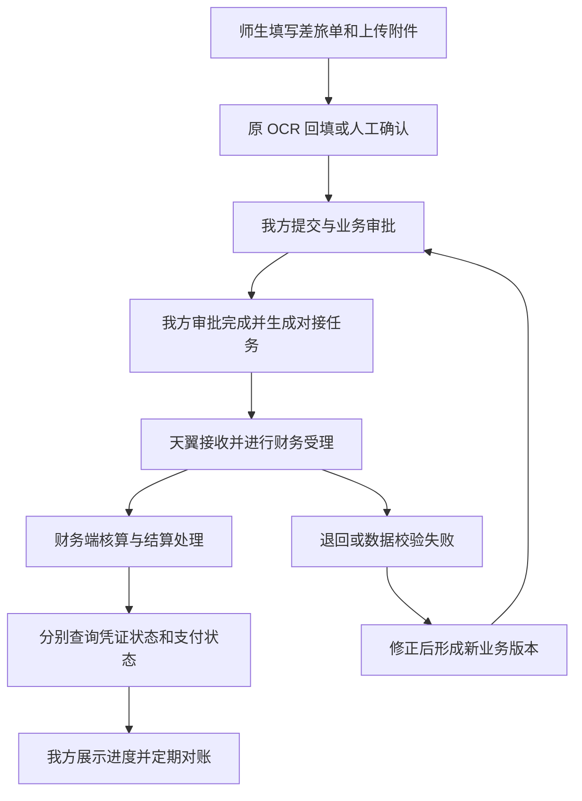

# 天翼财务系统介绍与对接调研

版本：V1.0（公开资料调研版）  
编写日期：2026-09-15  
适用对象：校园智能报销审批平台产品、研发、财务、信息化及对接厂商人员

## 阅读说明

用户提供的[豆丁文档](https://www.docin.com/p-1124793801.html)目前未能读取正文，因此**本文不是该文档的逐页解读，尚不能确认该链接的标题、版本、页数及具体内容**。本文依据厂商官网、高校财务通知及对接采购公告，暂以“复旦天翼／复翼高校财务产品系列”为调研对象。取得原文或学校系统信息后，应复核产品身份和版本差异。

本文采用以下标记，避免将产品宣传、他校案例和本项目设计混为一谈：

- **公开资料确认**：相应官方页面明确介绍的产品能力或历史事实，不等于本校已安装。
- **高校案例**：特定学校、特定年份的实现或采购需求，不能直接视为通用标准接口。
- **本项目建议**：针对现有报销平台提出的设计，不是天翼厂商提供的协议。
- **待确认**：必须通过学校现网信息、合同、厂商说明或测试结果核实。

本次只新增系统介绍与对接调研，不改变现有技术方案实施阶段，**OCR 功能、接口和配置保持原方案**。本文中的字段、状态和接口能力名称均为内部建议，不能拿来直接请求天翼系统。

---

## 1. 系统是什么，以及为什么与本项目相关

### 1.1 名称与产品范围

**高校案例：**南京邮电大学 2020 年采购公告将“上海复旦天翼计算机有限公司”与“上海复翼软件开发有限公司”联系起来，列举学校使用过的账务处理、薪酬、学生收费、无现金报销和网上预约产品。这说明本次调研应关注高校财务产品体系，而不能仅凭“天翼”二字推定为某个云服务。[南京邮电大学采购公告](https://zbb.njupt.edu.cn/zbgghwl/4772.chtml)

不同地区的维护公司、历史合同主体和版本可能不同。本文使用“天翼”作为讨论简称，不据此认定本校的签约主体或接口所有权。

**本项目理解：**报销审批平台主要帮助师生组织材料、提交申请、完成内部审批；财务系统则负责将业务转化为财务可执行、可核算、可对账的记录。两者对接的价值是减少重复录入，并让申请人获得可靠的后续处理进度。

### 1.2 不能把旧手册当作现网规格

**高校案例：**北京工商大学 2018 年公开材料明确提到 V4.0，并介绍项目核算、预算控制和网上查询。该资料可以证明历史版本的使用，不能证明本校版本或今天的接口能力。[北京工商大学采购公示](https://zcc.btbu.edu.cn/sylm/zbjggg/137134.htm)

**高校案例：**江西理工大学 2019 年通知介绍了财务软件更新、跨校区管理和财务综合服务平台启用。它反映的是该校当时的业务部署安排；登录方式、报销材料及操作步骤不能直接套用到本校。[江西理工大学启用通知](https://cw.jxust.edu.cn/info/1098/1401.htm)

### 1.3 当前能够给出的结论

1. 存在与高校报销、经费控制和核算密切相关的产品系列及落地案例。
2. 对接具有现实先例，但本校是否购买相应模块、是否开放接口尚未确认。
3. 应先确定财务端接收的是“报销业务单”“预约单”还是“凭证草稿”，再确定开发边界。
4. 暂时不能确认天翼现网的数据库、开发语言、通信协议、单点登录协议、吞吐能力或高可用方式。

## 2. 产品模块概览

### 2.1 厂商公开的产品能力

**公开资料确认：**厂商产品页列有以下模块。下表为压缩概览，具体购买、启用和第三方开放情况均待确认。[复翼官方产品介绍](https://www.shfuyi.com.cn/productInformation.html)

| 模块 | 官网介绍的范围 |
| --- | --- |
| 财务管理 | 项目核算、预算控制、平行记账、国库业务及对账 |
| 网上预约报账 | 项目授权、额度控制、附件、审批、多项目和往来核销 |
| 无现金支付 | 对公、对私结算，身份及额度控制 |
| 全面预算 | 项目库、预算编制、下达、执行和绩效 |
| 工资薪金 | 人员与薪酬申报、计算、税务数据及凭证 |
| 票据管理 | 领用、开票、缴销及账务关联 |
| 资产平台 | 采购、资产生命周期及财务协同 |
| 缴费平台 | 收费事项、缴费及账务关联 |
| 财务驾驶舱 | 按管理角色分析和展示财务数据 |

以上是产品范围，不是接口清单；产品内部模块互通也不意味着第三方拥有相同调用权限。

### 2.2 面向本项目的模块解释

以下为**业务概念解释和本项目关注点**，不声称描述本校天翼界面的实际菜单。

#### A. 核算与账务

核算解决“这笔业务记到哪个账套、哪个期间、哪些科目和项目”的问题。报销单是业务证明，记账凭证是会计记录，两者不能简单一对一假定。

对接时重点确认：财务是否接受业务单后自行制证；同一单据能否拆为多张凭证；多单是否会合并制证；凭证作废或冲销是否有回传；财务会计与预算会计关联是否由财务端处理。

推荐本项目传递业务事实和经财务确认的编码，凭证分录规则由财务端及其模板负责。不能由 OCR 金额直接生成未经审核的最终记账凭证。

#### B. 经费与预算

经费项目回答“从哪里列支”，预算指标回答“哪些费用可以使用多少额度”，人员授权回答“谁可以动用”。页面看到的余额只是某一时刻的查询结果。

对接时必须区分总预算、已执行额、冻结额、在途额和可用额。不同系统可能采用不同口径，不能在我方用几个字段自行推导所谓权威余额。

推荐财务端维护权威额度，我方提供查询及提示；如需严格防超支，应获得财务端原子冻结或受理校验能力。

#### C. 网上报账与审批

这是与现有平台重叠最多的部分。最重要的决策是：师生在哪里填单，主管在哪里审批，财务在哪里受理。同一业务节点不宜在两个系统分别维护最终结果。

推荐我方负责申请和业务审批；天翼负责财务受理与后续核算。如果校方要求保留天翼网上报账入口，则优先研究厂商支持的草稿导入或页面跳转能力，避免两套平台要求用户重复填写。

#### D. 结算与付款

“受理”“制证”“支付指令提交”“银行处理成功”含义不同。若一张报销单涉及多名收款人或多笔支付，应按支付明细跟踪，不能只保存一个成功标记。

本项目首期对接建议只展示财务端确认的付款结果，不接管银行证书、支付复核和资金划拨权限。

#### E. 票据、收费、薪酬、资产和分析

“票据管理”可能指学校收款开票及票据领用，不能推定包含供应商发票验真或跨系统报销防重。收费是学校收钱，报销通常是学校付钱，两类票据需要区分。

薪酬涉及人员和税务，资产涉及验收及资产入账。它们属于未来劳务、采购报销扩展应确认的业务依赖，一期差旅对接不必同步建设这些模块。分析看板可使用授权后的汇总结果，但不能让报表查询阻塞财务交易。

## 3. 核心术语与数据关系

以下定义用于双方需求沟通，实际名称和编码以厂商数据字典为准。

| 术语 | 通俗解释 | 对接中的关键问题 |
| --- | --- | --- |
| 账套 | 一组相对独立的会计账和核算配置 | 本校是否多账套，接口账号可访问哪些账套 |
| 会计年度／期间 | 财务记录所属年份和月份等期间 | 结账后能否受理，跨年单据如何处理 |
| 部门 | 组织或财务归属单位 | 校内部门 ID 与财务部门编码是否一致 |
| 经费项目 | 用于归集和控制收支的项目 | 项目是否停用、结题、允许当前人员使用 |
| 科目／支出分类 | 财务或预算的分类编码 | 与我方差旅费用类型如何映射，谁维护 |
| 往来／借款 | 尚未完成核销的借支或应收应付记录 | 是否冲借款、核销哪一笔、冲抵多少 |
| 冻结 | 为在途业务保留额度 | 冻结编号、有效期、解冻和转执行规则 |
| 报销单 | 业务申请及费用材料集合 | 外部业务号是否唯一，变更是否另起版本 |
| 凭证 | 财务形成的会计记录 | 凭证类型、编号、年度、账套共同定位 |
| 支付单／支付明细 | 一次结算安排及具体收款明细 | 部分成功、失败、退汇和再支付如何表达 |
| 冲销 | 按财务规则纠正已发生记录 | 不能用删除我方单据代替财务冲销 |

**本项目建议的数据关系：**一个报销单包含多条费用、多张票据和附件；可以分摊到多个经费项目；与凭证、支付记录分别建立关联表。初期业务界面可限制单项目和单收款人，但持久化模型不要假定所有财务记录永久一对一。

## 4. 典型业务链路及系统分工

### 4.1 建议链路

下图为本项目建议流程，不是天翼现网流程图。核算与支付的具体先后顺序、是否并行，由本校财务确认。



OCR 失败不阻止按原业务规则提交；财务确认依据人工核实信息与原始材料。对接不新增 OCR 成功门槛，也不将识别视为验真。

### 4.2 推荐职责边界

| 事项 | 建议权威方 | 我方职责 |
| --- | --- | --- |
| 身份与组织 | 学校身份／组织系统，财务编码由财务方确认 | 维护稳定标识映射，不复制密码 |
| 单据内容与业务审批 | 我方平台 | 表单、附件、版本、审批和操作轨迹 |
| 项目授权和权威余额 | 财务系统 | 同步必要信息，显示数据时间，调用校验能力 |
| 财务合法性审核 | 校方指定财务环节 | 不能以内部 APPROVED 绕过财务受理 |
| 凭证和会计处理 | 财务系统 | 存外部引用和结果，不直接改天翼账表 |
| 付款与银行结果 | 财务／支付系统 | 查询与展示，不自行推定支付成功 |
| 发票防重 | 我方管本平台，跨系统需财务统一方案 | 保留本地占用，协调外部历史及其他入口 |
| 对接重试、告警与对账 | 双方约定，我方实现本地跟踪 | 可追溯失败、查证未知结果、人工闭环 |

现有我方“财务批”上线对接时需要重新命名和确定权限：推荐作为内部财务预审，天翼受理负责最终核算校验；若双方决定合并财务审批，应形成书面流程映射，并明确哪一方是最终状态来源。

### 4.3 示例：差旅报销 1,200 元

以下为说明性示例：教师选择项目 P001，填报交通 800 元、住宿 400 元。我方内部审批通过后，用固定外部业务号发送同一版本数据。天翼返回接收编号，仅说明已接收，不能显示已到账。

若财务核减住宿 100 元，应展示“申请 1,200 元、财务确认 1,100 元”及原因，按学校规则补充确认，不能静默改原申请金额。若存在借款冲抵，实际转账金额还可能不同。凭证状态和支付结果独立回传，最终按财务认可的口径对账。

## 5. 已查到的外部对接证据

### 5.1 经费接口具有高校实施先例

**高校案例：**浙江树人学院 2022-03-28 公示提出通过工号关联经费项目，进行冻结、解冻及按采购结果调整占用，并取得经费归口部门。公告还提及接口文档和 `username`、`userkey`、`version` 参数名称。[浙江树人学院对接采购公示](https://old.zjsru.edu.cn/info/1043/10130.htm)

这些是该校采购事项中的信息，**不代表已获得完整接口定义**。不能据此推断 URL、HTTP 方法、签名算法、报文格式或本校可用权限；也不能将这些参数拼成未经确认的示例请求。

### 5.2 接口开放可能需要专项服务

**高校案例：**南京旅游职业学院 2021 年财政辅助核算模块采购说明涉及财务、预约报销与预算管理一体化的数据衔接，并在该采购背景下说明了对其他软件公司的接口开放限制。[南京旅游职业学院公告](https://cg.nith.edu.cn/zcglc/cgxxfwl/20211020/6513.html)

**本项目推论：**不能将对接成本只估为我方编码时间，还应核实接口许可、厂商实施、专网联通、测试环境及升级维护责任。上述案例不证明所有学校接口都不开放，也不证明必须使用同一地区服务商。

## 6. 推荐对接方式

### 6.1 选择顺序

| 方式 | 适用条件 | 本项目意见 |
| --- | --- | --- |
| 厂商正式业务接口 | 支持相应业务，提供文档、账号和测试环境 | 首选；以官方支持的协议为准，不预设 REST |
| 校方集成平台转接 | 学校已有数据总线或服务网关，厂商提供后端业务能力 | 可优先复用，明确平台和财务端各自的结果语义 |
| 厂商认可的批量文件导入导出 | 无实时接口，但支持稳定模板及回执 | 作为可落地过渡方案，逐行确认结果和对账 |
| 授权只读视图 | 厂商书面支持，只用于查询 | 仅补充读数据，不承担写入、冻结和付款 |
| 页面自动化／直接写财务库 | 无稳定业务契约 | 不作为推荐生产方案，容易绕过校验且难保证重复执行正确 |

### 6.2 本项目落点

在现有模块化单体中新增 `finance.integration`，定义 `FinancePort`，实现厂商适配器；复用 MySQL 任务表和独立 worker，不为一次对接引入微服务。

```text
claim/workflow
    │ 本地事务：保存审批结果和对接任务
    ▼
job_task → finance worker → FinancePort → 厂商接口 / 校方网关
    ▲                                          │
    └────── 查询结果 / 鉴权回调 / 文件回执 ──────┘
             ↓
        外部关联、审计、对账差异
```

我方数据库事务无法包住远端财务事务。采用本地可靠任务、稳定业务号、结果查询和对账实现最终一致；不能在持有我方审批行锁期间等待财务接口。

## 7. 对接能力清单（需求，不是已知 API）

“优先级 P0”表示自动化闭环所必需；厂商不支持时必须改为受控人工流程，不能模拟成功。

| 能力 | 方向 | 优先级 | 必须确认的行为 |
| --- | --- | --- | --- |
| 账套、部门、人员编码映射 | 财务／校方 → 我方 | P0 | 标识范围、停用、调动、年度变化 |
| 费用类型与财务编码字典 | 财务 → 我方 | P0 | 必填维度、启停日期及映射负责人 |
| 可用经费项目与权限 | 财务 → 我方 | P0 | 按人员授权查询，不能全校项目任意选择 |
| 余额／可用额度查询 | 财务 → 我方 | P0 | 余额定义、更新时间、是否含在途业务 |
| 报销业务受理 | 我方 → 财务 | P0 | 接收对象、幂等标识、附件要求、受理号 |
| 按外部业务号查结果 | 财务 → 我方 | P0 | 超时后可查，区分未接收与未知状态 |
| 凭证及支付进度 | 财务 → 我方 | P0 | 分项结果、失败原因、冲销／退汇事件 |
| 冻结／解冻／转执行 | 双向 | 条件 P0 | 若承诺跨入口不超预算则必需；原子性、幂等及超时查证 |
| 撤回／作废 | 我方请求、财务确认 | P1 | 受理、制证、付款后分别是否允许 |
| 增量结果／对账清单 | 财务 → 我方 | P0 | 范围、游标、金额和状态语义 |
| 附件上传和关联 | 我方 → 财务 | P0 | 上传凭证、大小、格式、完整性及过期 |
| 历史票据防重查询／占用 | 双向 | 条件 P0 | 若承诺跨系统防重则必需；所有入口共同执行 |

若财务方不开放支付结果，我方只能显示“财务受理／记账信息”，付款状态标注“未获取”，不得展示已付款。若无冻结能力，我方只显示参考余额，实际预算把关留在财务端。

## 8. 字段映射建议

### 8.1 报销请求模型

以下字段名称为我方内部规范；厂商字段名、长度、枚举、精度均待正式文档确认。

| 我方建议字段 | 含义 | 处理要求 |
| --- | --- | --- |
| source_system | 来源系统标识 | 与厂商登记一致，区分测试和生产 |
| external_business_id | 稳定业务标识 | 含来源、账套及单据唯一标识；重试不得换号 |
| business_version | 单据业务版本 | 修正重提才变更，传输重试不变更 |
| account_set / fiscal_year | 账套和年度 | 财务确认规则，不能只取服务器当前年份 |
| claim_no / claim_type | 我方单号和类型 | 类型需显式映射，无匹配则待处理 |
| applicant_code / handler_code | 申请人与经办人 | 区分代办；使用稳定人员编码，保留前导零 |
| department_code | 财务部门编码 | 提交快照，避免人员调动后改变历史 |
| currency / requested_amount | 币种及申请总额 | 一期可限定人民币，使用十进制定点金额 |
| expense_lines | 费用明细 | 日期、类型、金额和业务说明；与总额校验 |
| project_allocations | 项目分摊 | 项目、金额及需要的支出维度；分摊总额一致 |
| invoice_items | 人工确认票据信息 | 原始附件与人工确认值可追溯，OCR 不是权威值 |
| payment_items | 收款或冲借款明细 | 若接口要求则提供；敏感数据最小化 |
| attachment_refs | 附件列表与校验和 | 使用厂商认可的传输方式，不发永久公网 URL |
| approval_evidence | 内部审批证明 | 节点、处理人、时间、意见、版本；与财务认可形式一致 |
| payload_hash | 本地规范报文摘要 | 校验相同幂等键是否对应相同内容 |

### 8.2 回执模型

建议分别保存接收编号、业务校验结果、财务确认金额、凭证列表、支付明细列表、变更时间／版本、拒绝原因和原始状态码。

凭证引用至少确认账套、年度、凭证类别、编号是否共同唯一；支付结果至少能对应支付明细及其尝试次数。不能用“凭证号不为空”推断已记账或已付款。

### 8.3 校验与变更原则

- 必填财务编码缺失时进入待补充，禁止用默认部门或项目凑单。
- 金额统一精度后校验总分关系；核减、借款冲抵、补付单独记录，保留原申请。
- 银行卡、账号、人员编号按字符串处理，不能当数值丢失前导零。
- 时间戳带时区；业务日期、会计日期和接口接收时间分开。
- 原始状态、映射版本和生效日期都保留，升级后可追查历史解释。
- 已被财务接受的数据修改，先查允许操作和远端状态，不直接覆盖已发送版本。

## 9. 状态模型、重复请求和异常恢复

### 9.1 独立跟踪四类状态

**本项目建议：**保留原 `claim_form.status` 表示我方审批；新增关联记录跟踪外部状态，不把所有阶段塞进一个 APPROVED。

| 状态维度 | 我方建议值 | 用途 |
| --- | --- | --- |
| 传输 | PENDING / SENDING / UNKNOWN / ACKNOWLEDGED / FAILED | 是否发出及是否得到可靠接收结果 |
| 财务受理 | NOT_SUBMITTED / ACCEPTED / RETURNED / CANCELLED / UNKNOWN | 财务是否接收并允许继续处理 |
| 核算 | UNKNOWN / DRAFT / POSTED / REVERSED | 财务是否完成记账，是否冲销 |
| 支付明细 | UNKNOWN / PENDING / PARTIAL / PAID / FAILED / REFUNDED | 根据财务权威结果表达结算进度 |

枚举为内部建议。原始代码必须保留，映射不认识的代码进入 UNKNOWN 并告警。付款退回、冲销等属于新事件，不适合仅以“状态只能向前”处理。单据级支付汇总要根据全部明细、有效金额及退汇情况计算。

### 9.2 超时后的正确处理

1. 我方固定业务号发送版本 V1。
2. 天翼可能已受理，但响应在网络中丢失，我方进入 UNKNOWN。
3. 我方按业务号查询；查到结果则补登记，不能再创建另一张单。
4. 若厂商保证同业务号幂等，可按同号同内容重试。
5. 若查询具有延迟，“暂未查到”不等于“确定未受理”；按厂商时限等待并再次核对。
6. 若既无可靠查询又无幂等保障，停止自动写重试，交财务和厂商查证。绝不自动换业务号重新提交。

### 9.3 回调和主动查询

回调需验证签名或双方认可的身份认证，检查时间窗口和事件标识；不能只相信来源 IP。先持久化接收事件，再异步处理，重复事件只处理一次。

优先按厂商事件版本或序列处理乱序；没有可靠顺序信息时重新查询权威状态，不只比较本地到达时间。主动查询用于补回调丢失，定期对账用于发现长期不一致。

### 9.4 撤销和冻结释放

外部受理后，我方撤销先进入“撤销申请中”，待财务确认可撤销再改变最终状态。外部状态未知时不得先释放我方票据占用或预算冻结，否则可能形成重复报销。

冻结成功而后续提交失败时，以原冻结引用申请释放；释放超时同样需要查询，不能本地标记成功。财务制证或付款后遵循厂商和校方冲销流程，禁止用普通撤销替代。

## 10. 预算并发与跨系统票据防重

### 10.1 余额查询不能替代占用

假设项目可用 1,000 元，两个系统同时查询后各提交 800 元。两边的本地校验都可能通过。要避免超预算，必须在权威财务端原子地校验和占用，或由财务受理时统一拒绝超额请求。

推荐以“业务号+项目分摊行”标识冻结，确认是否在提交、业务审批通过或财务受理时冻结。上线前核实已有天翼报账入口是否也冻结，避免同一单据冻结两次。

多个项目不能原子冻结时，要记录逐项结果，失败后释放已经成功的部分；补偿未确认前保持处理中并告警。首轮可限制单项目以降低实施复杂度，但需要财务认可。

### 10.2 票据防重范围

现有 `invoice_occupation` 只能保证我方入口内的并发唯一。若师生仍能在天翼或其他平台提交同一发票，本地唯一索引并不能覆盖那些入口。

推荐取得统一财务票据占用／核验机制；仅定时同步历史票据可以减少重复，但不能消除同步窗口内的竞争。若无法统一占用，清楚标注一期跨系统防重依赖财务受理复核，不承诺实时全局唯一。

本节不改变 OCR：识别负责辅助录入，票据唯一标识来自人工确认及校验规则，验真能力仍按原方案分期。

## 11. 我方数据表与任务扩展建议

以下是后续开发建议，不是天翼数据库结构，也不代表已修改当前数据库设计。

| 建议对象 | 主要内容 | 约束 |
| --- | --- | --- |
| finance_submission | 单据、版本、目标系统、业务号、报文摘要、传输与受理状态 | UNIQUE(target_system, account_set, external_business_id, business_version)；远端是否同样按版本区分需确认 |
| finance_external_ref | 本地单据与外部受理单、凭证、支付明细关联 | 支持一对多及多单合并，不只在 claim_form 放一个凭证号 |
| finance_budget_hold | 项目分摊、外部冻结号、金额、冻结/释放结果 | 明确归属版本，未知状态不能删除记录 |
| finance_callback_event | 事件 ID、验签结果、报文摘要、接收和处理时间 | 按来源及事件 ID 去重，敏感报文加密并限期保留 |
| finance_code_mapping | 人员、部门、费用等编码关系及生效版本 | 无有效映射时拒绝自动传输 |
| finance_reconcile_diff | 对账批次、对象、差异类型、处理人、结论 | 差异关闭需要证据，禁止自动抹平 |

传输任务复用 job_task，任务内容只保存业务引用和版本，不放密钥、图片或银行卡明文。远端受理号落库失败后，通过稳定业务号查询恢复关联。

## 12. 安全、并发及运维要求

### 12.1 安全边界

- 后端或校方网关访问财务端，浏览器不持有接口密钥。
- 测试和生产账号隔离，授权限定账套、业务类型和必要操作；不因对接给我方财务库管理员权限。
- 私网通信仍需双方认可的加密认证；如旧接口安全能力不足，由校方提供受控网关并明确边界。
- 凭据受限存储和轮换，日志只记追踪号、动作、耗时及脱敏结果。
- 附件传输校验大小与校验和，明确访问凭证有效期和失败重传；不把全部票据打包到普通接口日志中。
- 接口认证证明调用系统身份，不能代替校验实际经办人的项目使用权限。
- 正式付款权限留在财务端，不复制 UKey、银行口令或人为绕过双人复核。

### 12.2 吞吐与故障隔离

天翼现网容量未知，不能照搬我方 API 的并发目标。联调从单并发和小批量开始，根据厂商限制逐步增加；请求速率、超时、批量条数均配置化。

查询与写操作独立限流，按账套及业务维度避免同单并行写入。收到限流或持续超时后暂停扩量，采用退避及告警；财务服务不可用时，我方可继续按既有规则接收申请，但显示“待财务同步”，不伪造受理成功。

增量同步使用厂商稳定游标；没有游标时使用更新时间加唯一标识、重叠时间窗口和本地去重，并补全量核对。仅靠更新时间可能漏掉删除、回填历史日期或同秒变更，必须确认变更语义。

### 12.3 对账与监控

建议工作时段持续同步进度，每日执行一次对账，实际频率根据财务窗口和接口额度确定。对账范围包括单据数、受理结果、申请与核定金额、凭证关联、支付明细、冻结余额及释放结果。

对于借款冲抵、税费或拆分付款，不直接要求“申请总额=银行转账总额”；按财务确认的业务组成核对。差异分类至少包括我方有而对方无、对方有而我方未关联、金额不符、状态长期未知、重复受理和冻结未释放。

监控任务积压时长、受理成功率、UNKNOWN 数、接口延迟、重试量、回调验签失败和对账差异。恢复备份后先查远端状态，再恢复写任务，防止旧备份造成二次提交。

## 13. 建议实施阶段与验收

### 阶段 A：确认对象和边界

收集版本、合同模块、维护厂商、接口文档与数据字典。与财务共同决定接收对象、审批归属、预算占用时点和支付结果口径。输出双方确认的能力清单及字段映射；在此之前不承诺固定对接工期。

### 阶段 B：只读与映射验证

使用测试账套验证人员、部门、项目、授权和余额；准备正常、停用、无权限、跨年及多账套样本。先证明编码和权限正确，再开启写操作。

### 阶段 C：最小业务闭环

限定单项目、人民币、常规差旅，完成原审批、附件传输、业务受理、状态查询和对账。借款、多项目、拆分付款等复杂业务在未支持时明确转人工，不让其误入自动通道。

### 阶段 D：并发与异常验收

| 场景 | 必须得到的结果 |
| --- | --- |
| 同一请求重复发送 | 财务端只形成一份有效业务记录，或查证后禁止二次创建 |
| 财务已受理但响应丢失 | 我方查询恢复，无新业务号重复提交 |
| 同单多个 worker 竞争 | 版本和任务领取约束生效，不能交叉覆盖 |
| 预算同时被不同入口使用 | 权威端阻止超额，或明确拒绝并回传，不依赖缓存 |
| 仅部分项目冻结成功 | 已成功部分可追踪、补偿，未确认释放不能隐去 |
| 财务拒绝或核减 | 原申请保留，原因和金额差异可查看 |
| 凭证已生成但尚未付款 | 分别展示两种状态 |
| 多笔付款部分失败或退汇 | 单据不能整体误标全部到账 |
| 重复及乱序回调 | 去重并按权威状态收敛 |
| 停用项目、人员撤权 | 自动传输被正确拦截 |
| 附件不完整／校验和错误 | 不误报完整受理，允许受控补传 |
| 月结、跨年度 | 正确退回或按确认期间处理 |
| 备份恢复后重启任务 | 先查远端记录，避免重放造成重复业务 |
| 人工修改了天翼记录 | 对账发现差异，不自动覆盖财务记录 |

### 阶段 E：小范围试运行

选一个部门和受控业务量，核对每笔受理、凭证和付款结果；建立回退到人工办理的流程。停止自动同步时保留队列和外部关联，人工办理也登记同一业务号，恢复后逐笔核对再放量。

## 14. 向学校和厂商索取的资料清单

### 14.1 产品与商务

1. 系统正式名称、版本号、补丁号、部署年代和当前维护公司。
2. 已购模块、第三方接口许可、并发或账号限制。
3. 接口开发、测试环境、网关联通、后续升级分别由谁承担和收费。
4. 接口是否随升级改变，兼容期、维护窗口及故障响应安排。

### 14.2 业务与数据

5. 账套、年度、部门、人员、项目及费用编码字典和脱敏样例。
6. 财务接收报销单、预约单还是凭证草稿，必填字段及附件规则。
7. 原审批能否被认可，财务预审、复核和支付权限如何分工。
8. 可用余额的定义，冻结／释放／转执行的时点和编号。
9. 借款冲抵、核减、多项目、退汇、冲销、跨年如何处理。
10. 原入口是否继续开放，如何跨入口防重复票据和双重冻结。

### 14.3 技术协议

11. 正式接口文档、请求响应样例、错误码、协议及鉴权方式。
12. 外部业务号唯一范围、幂等保留期、重复请求返回内容。
13. 按业务号查单能力，“查不到”的一致性及延迟含义。
14. 回调是否支持、验签方式、重发机制、事件编号和顺序。
15. 分页、增量同步、批量上限、限流、超时及并发约束。
16. 附件上传／下载、私网访问、证书与账号配置要求。
17. 支付结果来源，部分支付、退汇、撤销和冲销的状态样例。
18. 对账清单、测试账号、异常测试数据和厂商联调联系人。

这些问题是后续实施的输入，不影响本文作为调研版阅读；其中产品身份、写接口幂等和财务状态口径未落实前，不宜开启真实自动写入。

## 15. 结论

本次公开资料支持将复旦天翼／复翼作为高校财务产品系列进行对接调研，也存在经费相关外部集成先例。但尚未取得用户所给豆丁正文、本校版本和正式接口说明，不能据此制作可执行的厂商 API 或承诺现网能力。

**推荐方向：我方负责报销材料和业务审批，财务端负责权威经费、核算和结算；通过厂商正式支持的接口或批量回执实现可追溯同步。** 先完成只读映射和单项目差旅闭环，再扩展预算冻结、多项目及复杂结算。OCR 按现有方案保留。

## 附录：来源与证据适用范围

访问日期均为 2026-09-15。来源中旧日期代表历史实例，官网未标注版本的能力不等于现网能力。本文没有取得真实账号、接口凭据、天翼数据库结构或厂商测试结果。

| 来源 | 日期 | 支持内容及限制 |
| --- | --- | --- |
| [用户提供的豆丁链接](https://www.docin.com/p-1124793801.html) | 未核实 | 正文无法读取，不作为已读证据 |
| [复翼官方产品介绍](https://www.shfuyi.com.cn/productInformation.html) | 页面未注明统一发布日期 | 产品模块概览；不是本校合同或接口说明 |
| [南京邮电大学财务系统升级公告](https://zbb.njupt.edu.cn/zbgghwl/4772.chtml) | 2020-11-03 | 历史产品使用与厂商名称关系 |
| [北京工商大学技术服务公示](https://zcc.btbu.edu.cn/sylm/zbjggg/137134.htm) | 2018-05-16 | 特定学校 V4.0 使用及模块说明 |
| [江西理工大学平台启用通知](https://cw.jxust.edu.cn/info/1098/1401.htm) | 2019-09-01 | 该校平台更新与服务安排；本次通过搜索返回正文片段核对 |
| [浙江树人学院对接采购公示](https://old.zjsru.edu.cn/info/1043/10130.htm) | 2022-03-28 | 经费接口对接需求实例；未取得实际协议 |
| [南京旅游职业学院辅助核算采购](https://cg.nith.edu.cn/zcglc/cgxxfwl/20211020/6513.html) | 2021-10-20 | 该项目接口协作与限制背景 |

取得豆丁原文及厂商材料后，下一版应补充：版本对应表、实际菜单和流程、已购模块、正式状态映射、字段字典、接口契约和联调结果；所有待确认项按证据逐项关闭。
