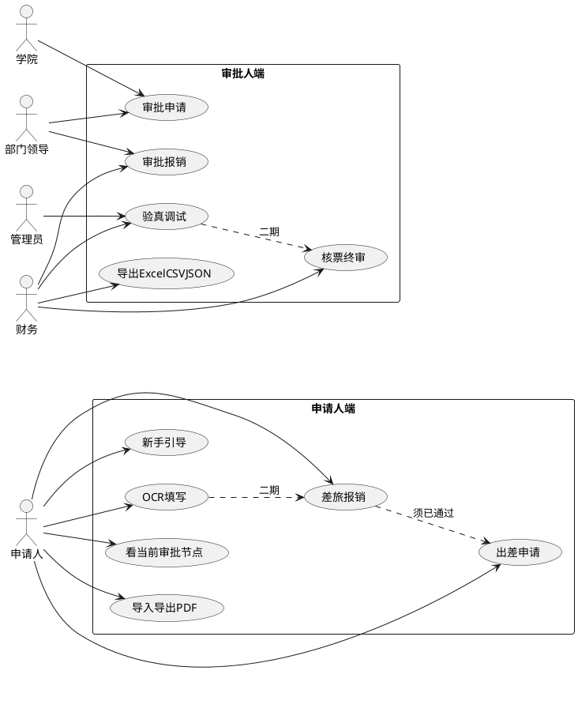
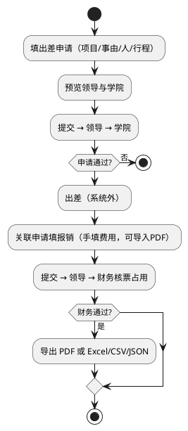

# 校园智能报销审批平台 — 实现方案

依据：[校园智能报销审批平台-技术方案.md](./校园智能报销审批平台-技术方案.md)、[智汇签 Demo](https://czi39594-jpg.github.io/zhihuiqian-reimbursement)。  
修订：2026-09-15。库表以技术方案第 5 节为准，本文不重复字段清单。

---

## 1. 范围

两个 PC Web 端、一套后端。差旅两张单，**申请不算钱，回来报销一次性核算**（不做预估经费、冻结）。

| 单据 | 时机 | 审批链 | 金额 |
| --- | --- | --- | --- |
| 出差申请 | 出发前 | 部门领导 → 学院 | 不填。库中 `claim_form.amount` 为空 |
| 差旅报销 | 回来后 | 部门领导 → 财务 | 费用明细合计，申请人确认 |

一期：手工填票、报销单 PDF 导入/导出、财务 **Excel（XLSX）/ CSV / JSON**、进度可见、新手引导。  
二期：OCR `VatInvoiceOCR`、验真 `VatInvoiceVerifyNew`、调试台。一期 `ocr.enabled=false`、`invoice-verify.enabled=false`，但代码留 `OcrPort` / `InvoiceVerifyPort`。

不在本期：CAS、抄送、校领导、付款到账、采购/科研、余额、uni-app。

---

## 2. 双端与角色

```text
/apply/    申请人端
/approve/  审批人端（领导、学院、财务、管理员）
/api/      Spring Boot
```

| 角色 | 端 | 权限 |
| --- | --- | --- |
| APPLICANT | 申请 | 本人两张单 |
| APPROVER | 审批 | 部门领导节点 |
| COLLEGE | 审批 | 学院节点（仅申请单） |
| FINANCE | 审批 | 报销财务节点、核票、导出 |
| ADMIN | 审批 | 配置；无默认财务终审 |

禁止自批。处理人由类型 + 部门算出，申请人不能点选。找不到处理人则禁止提交。

---

## 3. 差旅两张单

**申请单：** 登录带出申请人；`fund_project` 选项目代码；出差原因；起止日期；至少一人、至少一段行程（起讫、交通字典、出发日）。提交前只读预览领导、学院姓名。

**报销单：** `source_apply_id` 指向已通过申请。行程/人员/项目 **只读 join 申请单**，不复制。只编费用行、票据、可选收款账户。一期一张申请对应一张有效报销。

**进度：** 列表/详情/工作台共用 `ClaimTimeline`（数据来自 `wf_node` + `claim_todo` + `claim_flow_log`）。高亮当前节点、处理人、停留时长、超时；退回置顶并展示最近一条退回意见。报销详情分开展示申请已走完的链和报销当前链。节点变化写通知。

---

## 4. OCR / 验真（二期）

识别与验真分端口，识别成功 ≠ 真票。Worker 从对象存储读文件，只传 **ImageBase64**；禁止前端直连。配置与类名见技术方案第 2 节，二期勿改键名。

报销页角落「OCR 快速填写」仅二期渲染。调试台 `/admin/ocr-debug` 仅管理员。财务终审一期只看人工确认 + `invoice_occupation`；二期可要求验真 `PASSED`。

---

## 5. 导入导出与引导

| 能力 | 谁 | 说明 |
| --- | --- | --- |
| 导入报销单 PDF | 申请人、财务 | 挂到 `claim_file`，材料码报销单原件。**不解析费用行** |
| 导出 PDF | 同上 | 服务端 A4；草稿水印 |
| 清单 XLSX/CSV/JSON | 仅财务 | 同一筛选与列白名单；走 `data_export` + `job_task` |

新手引导一期必做（Tour + `user_guide_progress`）。首次覆盖：新建申请、新建报销、看进度、退回重提、三类审批、财务导出、导入 PDF。二期再加 OCR/验真。引导不能写业务状态。

---

## 6. 用例图



---

## 7. 活动图



---

## 8. 页面与接口

申请人：`/home`（当前节点）、`/travel-apply/*`、`/travel-claim/*`（含导入 PDF）、`/claims`、`/tasks`、`/help`。  
审批人：`/todo`、`/finance/claims`、`/finance/export`、`/admin/*`；`/admin/ocr-debug` 二期。

```text
/api/auth/*
/api/applicant/travel-applies
/api/applicant/travel-claims          body.sourceApplyId
/api/applicant/claims/{id}/timeline
/api/applicant/pdf/import|export
/api/approval/todos/{id}/pass|return|reject
/api/finance/claims
/api/finance/claims/{id}/invoices/confirm
/api/finance/export                   format=xlsx|csv|json
/api/finance/pdf/import|export
/api/me/guides
/api/jobs/{id}
```

二期：`POST .../ocr`、`POST .../invoices/{id}/verify`、`POST /api/admin/ocr-debug/*`。提交/审批带 `version`，规则见技术方案第 4 节。

---

## 9. 实施与验收

1. 登录权限、申请单状态机、Timeline 与通知。  
2. 报销关联申请、费用、附件、PDF、核票占用；OCR/验真端口空实现。  
3. 财务 XLSX/CSV/JSON 与 PDF 导出。  
4. 新手引导、压测备份。  
二期：识别、验真、调试台。

验收：申请单无应付金额；未通过申请不能报销；提交前后都能看到节点与处理人；三种财务导出行列一致；一期不开 OCR 按钮、不出网。库表迁移必须与技术方案第 5 节一致，并通过第 5.8 节 3NF 核对。
